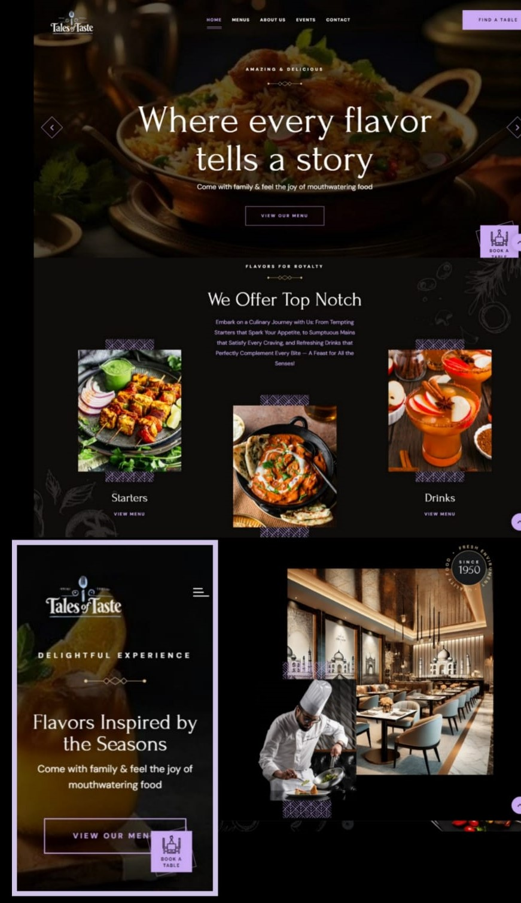

# Tales of Taste - Restaurant Website

## Project Overview
Tales of Taste is a modern, visually captivating restaurant website designed to deliver a rich and immersive experience for visitors. Using a dark theme with elegant typography and stunning imagery, the website captures the ambiance of fine dining, allowing customers to explore the restaurant's offerings and make reservations seamlessly. This website not only provides information but also creates a visual journey that brings the essence of the restaurant to life.

## Table of Contents
- [Features](#features)
- [Technologies Used](#technologies-used)
- [Screenshots](#screenshots)

## Features
- **Home Page**: Eye-catching hero section with a tagline, "Where every flavor tells a story," inviting customers to discover the menu.
- **Responsive Design**: Optimized for both desktop and mobile views, ensuring a smooth user experience across devices.
- **Navigation Bar**: Includes links to essential pages—Home, Menus, About Us, Events, and Contact—with a prominent "Find a Table" button for easy reservations.
- **Menu Highlights**: Showcases starters and drinks with high-quality images and descriptions to entice visitors.
- **Visual Storytelling**: Features images of the chef in action and luxurious dining spaces to convey exclusivity and sophistication.
- **Footer**: Contains essential links, contact details, and social media icons.

## Technologies Used
- **HTML**: For structuring and organizing content.
- **CSS**: To style the layout with custom animations and transitions.
- **JavaScript**: For enhanced interactivity and improved functionality.
- **Responsive Design Techniques**: Uses media queries and flexible layouts for optimal display on mobile devices.

## Screenshots

